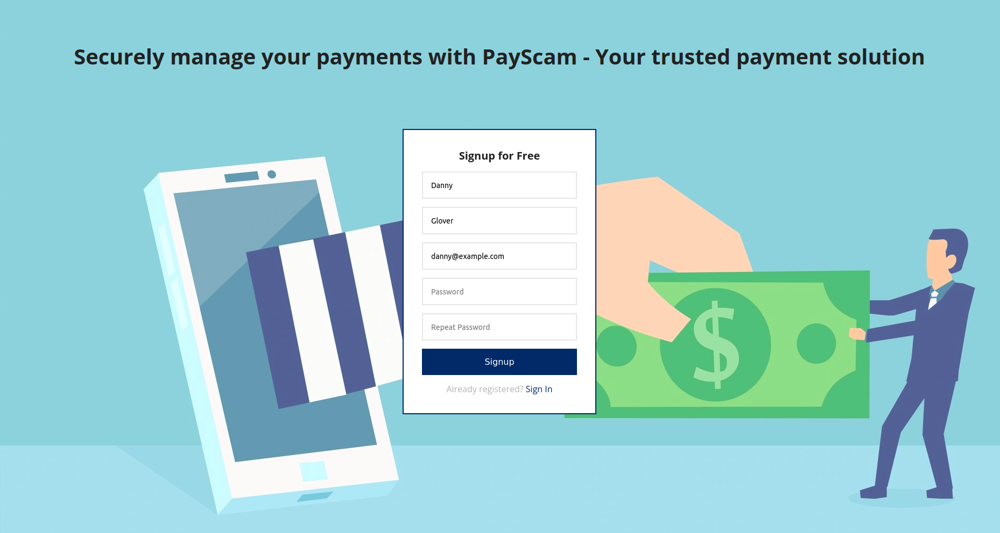
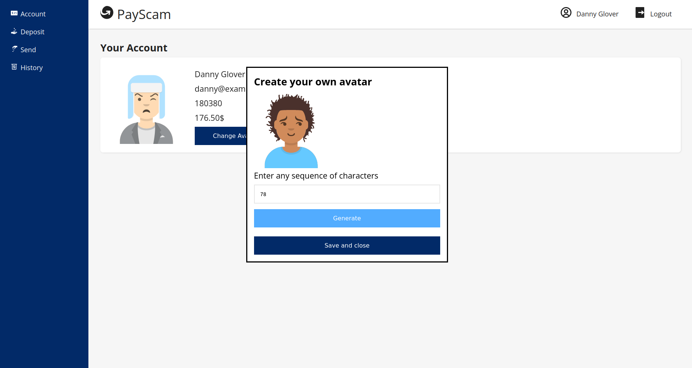
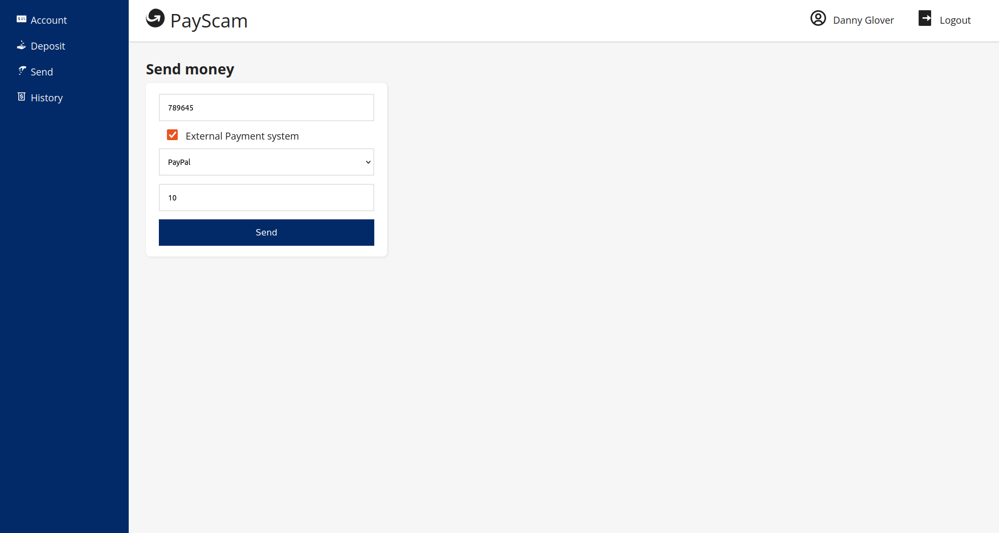
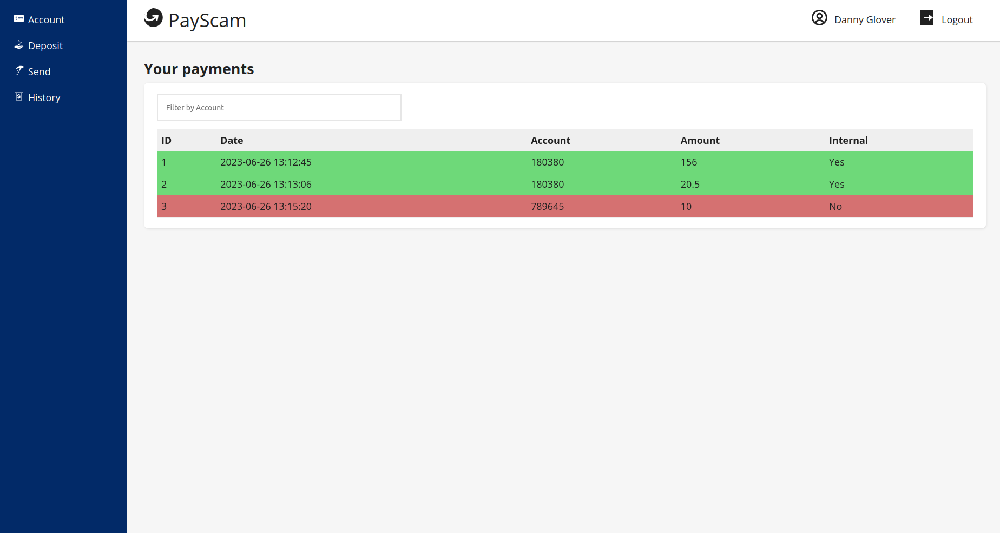

# NSS Payment System

PayScam je aplikace platebního styku, která umožňuje snadný převod finančních prostředků 
z jednoho účtu na druhý nebo do jiných platebních systémů.









# Azure deployment

Všechny základní služby jsou v ACI kontejneru. Na jednotlivé endpointy můžete volat pomocí 
Postman nebo podobných aplikací na adrese **20.113.78.86**

Aplikace React běží v jiném ACI kontejneru na adrese http://4.231.87.46:3000

## Jak spustit svou verzi PayScam lokálně

Create log files
```
sudo chmod +x create_logs.sh
./create_logs.sh
```
Run Docker Compose
```
docker-compose up --build
```
Aplikace bude dostupná v prohlížeči na adrese http://localhost:3000
<br>

Logy v Kibaně si můžete prohlédnout na adrese http://localhost:5601
<br>

Na adrese http://localhost:5601/app/management/kibana/indexPatterns/ 
můžete vytvořit index

## Použité technologie

- Spring Boot 3
- React + Vite
- Kafka
- ELK stack
- Hazelcast
- Docker
